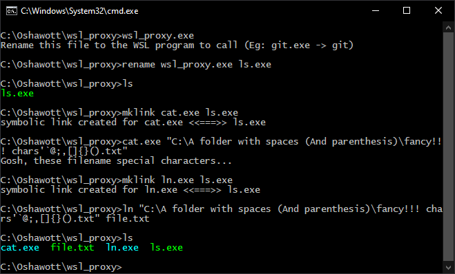

# wsl_proxy: Use your WSL binaries as Windows programs

Have you ever written `ls.bat`? Maybe something that looks similar to this?

```batch
@echo off
bash -c 'git %*'
```

Thankfully, these batch files work pretty nicely if you don't want to install two versions of every tool you have; one for Linux, and one for Windows. But unfortunately, you can't set `.bat` files as the default program to open files with, and you can't readily use a lot of these with IDEs since they often simply don't accept `.bat` files. You might also encounter path translation issues between systems.

Enter wsl_proxy!



If you rename it to `git.exe`, it will be WSL git. If you name it `emacs.exe`, it's gonna be WSL Emacs! You can put these in your path, give them to IDEs to use, and even assign your favorite Linux text editors as your default editor program, in Windows!

There is the added bonus that you don't need to configure multiple versions of things twice either! So if you have, for example, a fancy SSH configuration, not only can you still `ssh hostBehindProxyJumps` with your configs and your keys, your `git.exe` will also use them!

If you give wsl_proxy Windows paths, it will even translate them with `wslpath`, so you can run things like `git -C E:\SomePath\ log` and have it just work as expected.

*Note:* The WSL binaries wsl_proxy runs need to be on your path after `.bashrc` is run.
